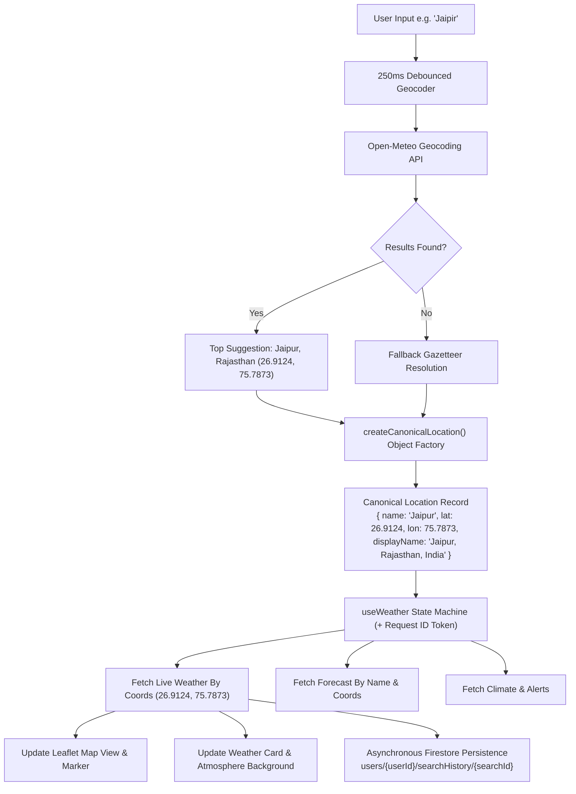

# WeatherGPT — Search & Location Accuracy Data Flow Architecture

## 1. Executive Overview

WeatherGPT implements an authoritative **Single Source of Truth** for geographical locations and weather telemetry. In complex frontend applications, multiple asynchronous components (search bar, autosuggest dropdown, interactive Leaflet weather map, 7-day forecast cards, impact alerts, AI chat assistant, and search history) frequently diverge due to inconsistent naming, differing coordinate decimals, or out-of-order API responses.

WeatherGPT eliminates this divergence through an authoritative **Canonical Location Model**, **Stale-Response Sequence Guard**, and **Unified Persistence Pipeline**.

---

## 2. End-to-End Search & Geocoding Pipeline



---

## 3. Authoritative Canonical Location Model

Every location in WeatherGPT is strictly instantiated via `frontend/src/utils/locationModel.js`:

```javascript
export function createCanonicalLocation(input = {}) {
  const latitude = Number(input.latitude ?? input.lat ?? 26.2389);
  const longitude = Number(input.longitude ?? input.lon ?? 73.0243);
  const name = (input.name || input.city || 'Unknown Location').trim();
  const state = (input.state || input.region || '').trim();
  const country = (input.country || 'India').trim();

  const parts = [name];
  if (state && state !== name) parts.push(state);
  if (country) parts.push(country);
  const displayName = input.displayName || parts.join(', ');

  return {
    name,
    displayName,
    latitude: Number(latitude.toFixed(4)),
    longitude: Number(longitude.toFixed(4)),
    country,
    countryCode: input.countryCode || input.country_code || '',
    state,
    timezone: input.timezone || 'Asia/Kolkata',
    source: input.source || 'open-meteo-geocoding',
    isCurrentLocation: Boolean(input.isCurrentLocation),
    createdAt: input.createdAt || new Date().toISOString()
  };
}
```

### Key Guarantees:
1. **Coordinate Normalization**: Coordinates are normalized to 4 decimal places (`~11 meters precision`), preventing floating-point cache misses and map jitter.
2. **Equivalence Checking**: `isSameLocation(locA, locB)` prevents duplicate search history entries and unnecessary re-fetches:
   ```javascript
   export function isSameLocation(locA, locB) {
     if (!locA || !locB) return false;
     const latDiff = Math.abs(Number(locA.latitude) - Number(locB.latitude));
     const lonDiff = Math.abs(Number(locA.longitude) - Number(locB.longitude));
     return latDiff < 0.01 && lonDiff < 0.01;
   }
   ```

---

## 4. Autosuggest & Typo Correction Flow

1. **Typo Resilience**: Searching for common user misspellings (e.g., `"Jaipir"` for `"Jaipur"`, `"Jodhpr"` for `"Jodhpur"`) triggers Open-Meteo's fuzzy phonetic resolver.
2. **Live Suggestions Overlay**: As the user types, suggestions appear with city name, admin region, and country flag.
3. **Keyboard Navigation & ARIA**:
   - `ArrowDown` / `ArrowUp` to cycle through suggestions with `aria-activedescendant`.
   - `Enter` to select canonical suggestion.
   - `Escape` to close overlay.
4. **Instant Canonical Adoption**: Clicking or selecting a suggestion passes the exact `{ name, latitude, longitude, country, state }` canonical object directly into `loadWeatherData(canonicalLoc)`.

---

## 5. Stale-Response Protection (Sequence Token Guard)

When users type rapidly or click between locations, asynchronous HTTP requests can complete out of order. If a slow request for `"Delhi"` completes after a fast request for `"Jodhpur"`, the UI could display Delhi's weather under Jodhpur's title.

WeatherGPT protects against this using a request counter ref in `useWeather.js`:

```javascript
const requestIdRef = useRef(0);

const loadWeatherData = useCallback(async (target) => {
  // 1. Increment sequence counter
  const currentRequestId = ++requestIdRef.current;

  // 2. Resolve coordinates
  const canonicalLoc = ...;

  // 3. Early check
  if (currentRequestId !== requestIdRef.current) return;

  // 4. Fetch telemetry concurrently
  const [weatherRes, forecastRes, alertsRes, climateRes] = await Promise.all([...]);

  // 5. Final check before state commitment
  if (currentRequestId !== requestIdRef.current) {
    console.warn(`[useWeather] Stale request #${currentRequestId} discarded for #${requestIdRef.current}`);
    return;
  }

  // 6. Commit state synchronously
  setLocation(canonicalLoc);
  setWeather(weatherRes);
  setForecast(forecastRes);
  setAlerts(alertsRes);
  setClimate(climateRes);
}, []);
```

---

## 6. Leaflet Map Centering & Marker Synchronization

The interactive weather map component (`frontend/src/components/map/WeatherMap.jsx`) observes canonical location updates:

1. **Map Centering**: Uses Leaflet's `map.flyTo([latitude, longitude], zoom, { animate: true, duration: 1.2 })`.
2. **Green Geolocation Pin**: When `geoState.coords` is active or `canonicalLoc.isCurrentLocation` is true, a distinct green pulse icon `📍 Your Current Location` is positioned at exact GPS coordinates.
3. **Layer Synchronization**: Map overlay tiles (Precipitation, Temperature, Wind, Clouds) immediately update their bounds to the new canonical coordinates.

---

## 7. Search History Persistence & Snapshot Synthesis

Whenever a canonical search completes, a search record is dispatched to:
1. **Local State / localStorage**: Immediate optimistic UI update.
2. **Firestore API (`POST /api/v1/history/search`)**: Asynchronous write to `users/{userId}/searchHistory/{searchId}` containing:
   - `rawQuery`: The exact text typed by user (e.g. `"jaipir"`).
   - `resolvedName`: The resolved canonical name (e.g. `"Jaipur"`).
   - `displayName`: Formatted string (`"Jaipur, Rajasthan, India"`).
   - `latitude` & `longitude`: Canonical coordinates (`26.9124, 75.7873`).
   - `weatherSnapshot`: Real telemetry at moment of search:
     ```json
     {
       "temperature": 32.4,
       "apparentTemperature": 34.1,
       "condition": "Clear Sky",
       "humidity": 45,
       "windSpeed": 12.0
     }
     ```
3. **History Page (`frontend/src/pages/History.jsx`)**: Loads real history from `GET /api/v1/history/search?userId={userId}`, displaying location, raw query if misspelled, timestamp, live weather badge, and one-click "Search Again".
